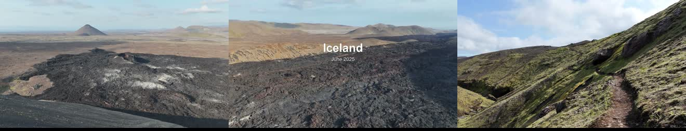
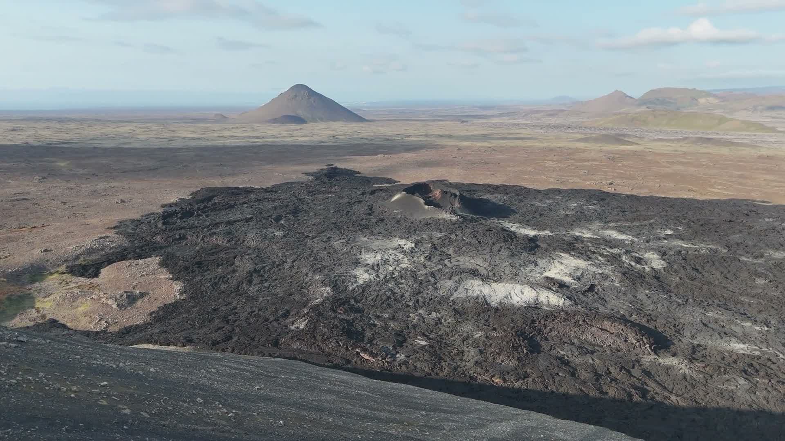
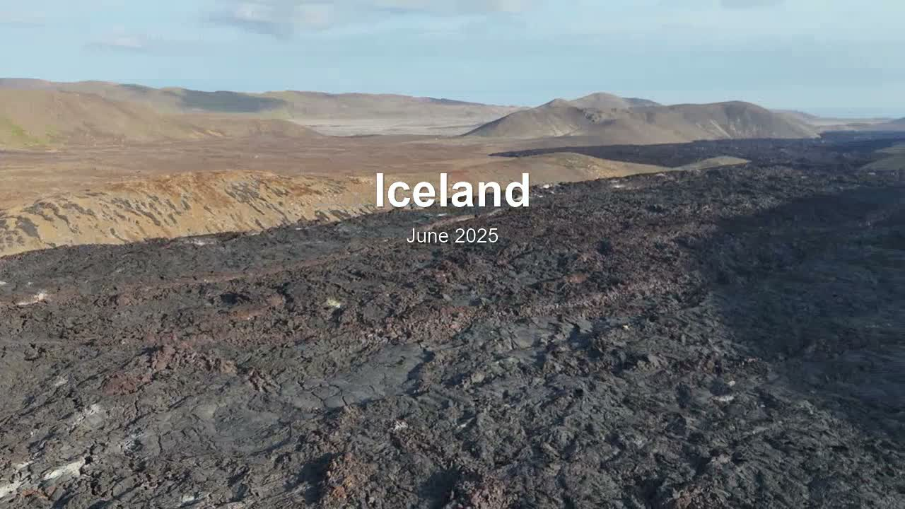
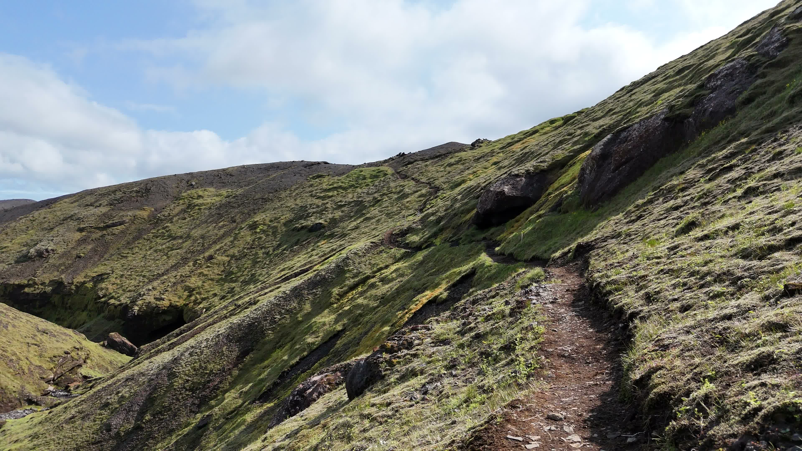

# 🚁 AiCutting — the AI Drone Director

**Drop in a folder of raw drone clips. Get a beat-synced, colour-coherent, title-carded
cinematic edit — from one local command.** No timeline, no cloud upload, no manual culling.

[](https://github.com/GeFAA/AiCutting/actions/workflows/ci.yml)




> A real cut from raw Iceland footage: the lava field opens, the location title rises from
> behind the ridge, and the journey resolves into the green highlands — every cut on the beat.

---

## ✨ What it does

- 🎬 **Watches your footage like an editor.** A local vision agent rates every moment, keeps the
  sharp, well-composed shots with real depth, and **throws out landings, takeoffs, low ground
  passes and filler.**
- 🥁 **Cuts exactly on the beat.** Pacing follows the music's energy — calm shots breathe, the
  drops cut fast — and every cut lands *on the beat*, not near it.
- 🎨 **Tells a visual story.** A per-shot colour signature orders the clips into a coherent
  journey (dark lava grouped first, flowing into the green) instead of jumping between scenes.
- 🎭 **Cinematic title that emerges from behind the terrain.** The location is recognised from
  the scenery, the date is read from the footage metadata, and the title rises out from behind
  the ridge — not a flat overlay.
- 🌀 **Tasteful motion & transitions.** Directional Ken-Burns push-ins on held shots, gentle
  crossfades through the calm sections, slow-mo on the calm establishing shots, and punchy hard
  cuts on the drops.
- 🎚️ **Pick a vibe.** `--style` presets — cinematic, epic, chill, or vlog — retune the whole edit
  (pacing, slow-mo, transitions, grade) from one flag.
- 📱 **Vertical & square masters.** `--aspect 9:16` reframes the whole edit into a full-bleed
  Reels / TikTok / Shorts master (or `1:1` for the feed) — cover-cropped to fill the frame, never
  stretched, no letterbox bars.
- 📊 **Shows its work.** A self-contained `report.html` with a thumbnail of every chosen clip and
  *why* it was kept, plus a live terminal view of each stage as it runs.
- 🎓 **Grades its own edit.** A built-in self-critic scores the finished cut — on-beat accuracy,
  shot variety, pacing — and shows the grade and breakdown in the report, so you see the quality,
  not just the result.
- 🔒 **100% local.** Vision agent (Codex / Claude Code) + FFmpeg. Your footage never leaves the
  machine. No agent? A deterministic fallback still produces a full, beat-synced edit.
- 🎞️ **Hands off to your NLE.** Exports a rendered MP4 *and* DaVinci Resolve / FCPXML / EDL
  interchange files.

---

## 🎥 The result

| The colour journey | The title reveal |
| --- | --- |
|  |  |
| Lava shots are grouped at the open… | …and the title rises out from *behind* the terrain. |
|  | Location auto-detected, date from metadata. |
| …flowing into the green highlands later. | |

---

## 🚀 Quick Start

```powershell
# 1. install (Python 3.11+, with FFmpeg on PATH)
py -m venv .venv
.\.venv\Scripts\Activate.ps1
py -m pip install -e ".[gui]"

# 2. cut a folder of clips to a song
aicutting cut .\input-videos --music .\track.mp3 --out .\output

# 3. open output\report.html to see every decision, and output\final.mp4 to watch
```

Pick a vibe with `--style` — **cinematic** (default), **epic**, **chill**, or **vlog**:

```powershell
aicutting cut .\input-videos --music .\track.mp3 --out .\output --style epic
```

Render a vertical master for Reels / TikTok / Shorts (or `1:1` for a square feed post):

```powershell
aicutting cut .\input-videos --music .\track.mp3 --out .\output --aspect 9:16
```

Just want the plan and the report without rendering?

```powershell
aicutting cut .\input-videos --music .\track.mp3 --out .\output --dry-run
```

Prefer a window? Double-click **`Start AiCutting.cmd`** (Windows) or run `aicutting-studio`.
More setup notes: [docs/quickstart.md](docs/quickstart.md).

---

## 🧠 How it works

```
 footage ─► analyse + beat grid ─► identify location (vision) ─► sample moments
        ─► rate & reject (vision agent) ─► diversify ─► colour-sequence the journey
        ─► lay onto the beat grid (exact) ─► motion + transitions ─► title reveal
        ─► render MP4  +  report.html  +  Resolve / FCPXML / EDL
```

1. **Analyse** every clip and turn the music into a full-length beat grid with energy.
2. **Identify the location** from representative frames (vision agent).
3. **Sample** the footage into contact sheets and **rate every moment** — keep cinematic shots
   with depth, reject landings / low passes / shaky / filler — then **diversify** to drop
   near-duplicates.
4. **Sequence by colour** into a coherent journey and **lay it onto the beat grid** so every cut
   is exact and energy-driven.
5. **Add craft** — directional push-ins, cohesive crossfades, and the cinematic title reveal.
6. **Render** the MP4 and write a visual `report.html` plus NLE handoff files.

Every stage writes an auditable JSON artifact (`footage-ratings.json`, `rhythm-grid.json`,
`edit-decision.json`, `cut-plan.json`, `timeline.json`, `director-3-report.json`,
`location-suggestions.json`).

---

## 📊 Total transparency

Open **`report.html`** after a run to see exactly what the AI did: the **self-critic grade** for
the finished edit (on-beat accuracy, shot variety, pacing), a thumbnail card for every clip in the
cut (source, length, transition, on-beat marker, and the agent's reason), the kept-vs-rejected
breakdown with grouped rejection reasons, and the energy grid that drove the pacing. The terminal
shows the same stages **live** as the run progresses.

---

## 🛣️ Roadmap — 4.0

3.0 makes a clean, beat-synced, colour-coherent, titled cut. **4.0 makes it feel hand-crafted**:
motion-aware judgment, edits that follow the song's structure, real colour grading, hero-shot
speed ramps, vertical/social masters, and style presets. See the full vision in
**[docs/ROADMAP.md](docs/ROADMAP.md)**.

---

## Requirements

- Python 3.11+ · FFmpeg (`ffmpeg` + `ffprobe`) on `PATH` · Windows 10+ (primary target).
- Optional: a current **Codex** or **Claude Code** CLI for the vision agent (selection, location).
  Without it, the deterministic fallback still produces a full edit.
- Optional: DaVinci Resolve for the interchange handoff.

## Privacy

The pipeline runs locally; your video files are read from the folders you pick and written to
the output folder you choose. The optional vision agent uses your local Codex / Claude Code
install and its own account settings — review those before running agent-assisted steps on
private footage. See [SECURITY.md](SECURITY.md).

## Development

```powershell
py -m pip install -e ".[dev,gui]"
py -m pytest        # test suite
py -m ruff check .  # lint
py -m mypy src      # types (strict)
```

See [CONTRIBUTING.md](CONTRIBUTING.md). Built and maintained by
[GeFAA](https://github.com/GeFAA). Released under the [MIT License](LICENSE).
